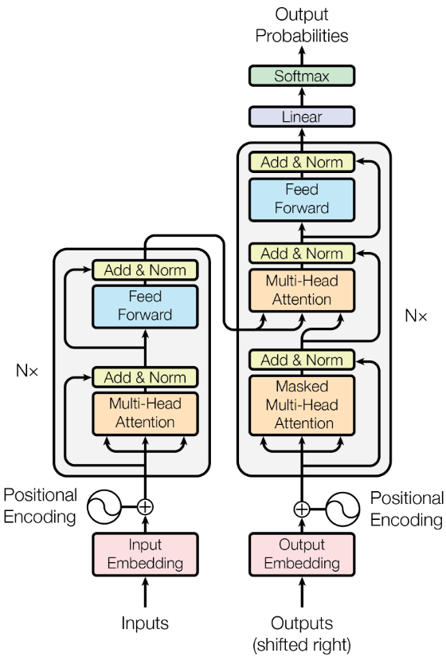
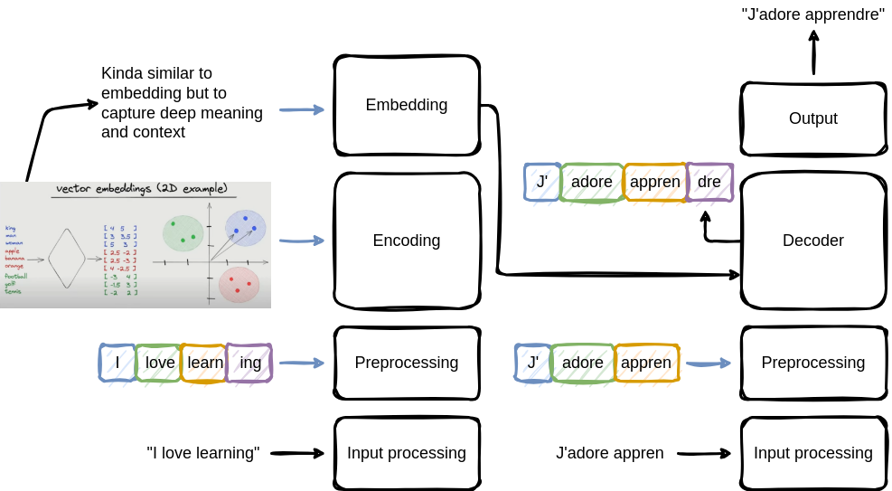

# ZeroToLLM
ZeroToLLM is a Python-based large language model I created to challenge myself and overcome imposter syndrome. Starting from scratch, this project is my way of proving to myself that I’m capable of building something complex and meaningful.

This README are notes I wrote down while studying LLM and creating my own. It might be useful, or not. Let's start digging into it.

## First shovel strike: What the h*ll are LLMs

Right now, the only things I know about LLM is that it's a new kind of text generation AI, that is somehow may better than anything created before. 

What is the difference with deep learning, machine learning, etc.? LLM is a subset of Deep Learning, which is a subset of Machine Learning, which is a subset of what we call "AI". Alright, that seams clear enough.

## Am I even doing something meaningful?: Finetuning or creating a LLM from scratch

Creating a LLM from scratch is gonna be hard. I never trained an existing model. The only thing I know about it is that you can provide data in the form of labeled or unlabeled text data and improve the effectiveness of a model doing specific tasks. 

Finetuning can be done for multiple goals, like better translating text, classify some data, or just have a better understanding of a specific subject. 

To be honest, even if it already has a level of complexity, I don't think it will help me cure my imposter syndrome.

In addition, creating my own set of quality data to train an existing model sounds hard and time consuming. I would rather create my own model and train it on opensource datasets. Of course, I'll be able to finetune my own model after pretraining it.

All of this sounds quite expensive by the way. I only have one RTX2080, so one of the challenge I will face is training with the means I have. Can I even pretrain my own model with my GPU?

## Wait, what tool do I need to dig?: What makes LLM so good

The secret seems to be about the "transformer" architecture, and its "attention mechanism". No idea what it means for now, but I'm sure it will be more clear once I continue learning about it. The paper "Attention is All You Need" from Google seems to be gold, but is very dense and very technical for me at the moment. Let's take it slowly.

The transformer architecture detailed in this paper has a multiple layers and steps. It deosn't seem to be completely linear by the way. Here is the image detailled in the paper:

Here is a very simplified version of the transformer architecture I made to help me understand it:

### Left side of the graph

**Input text layer:** The input text is basic english text
**Preprocessing layer:** The input text is tokenized. For now, I am not sure to understand what is means. The sentences and words seems to be split into smaller groups of characters. Here are my current questions:
- Why is it split this way?
- What is the splitting logic? Is it based on the frequence of a group of characters in the text?
**Encoding layer:**  This step is doing "vector embedding" of the tokenized text. It seems to be related to the semantic meaning of a token in the text. I guess it's necessay for the model to "understand" or have some kind of logical representation of the text. I can compare it to making groups of tokens that are similar in meaning, or linked to each other in some way. Here are my current questions:
- How is the semantic meaning of a token determined?
- Are their vectors "closer" or more similar when used in the same sentence?
- What are the different techniques to link the tokens together?
- I can visualise a 2D or 3D map of vectors, where similar tokens are close to each other. How many dimensions are used to represent the tokens? Is it 2D, 3D, or more?
**Embedding layer:** This step is seems to be doing something similar to the encoding layer, but with a different technique, to capture deeper meaning of the text. For now, I don't understand the technical differences between the two. Here are my current questions:
- What are the differences between the encoding and embedding layers?
- Why is it necessary to have two different layers to represent the text?
- What are the different techniques used in the embedding layer?

In the graph, the embedding layer output seems to feed a layer in the right side on the decoding layer. Let's continue with the right side of the graph to try to understand the whole process.

### Right side of the graph

**Input text layer:** The input text is not the same as the left side of the graph. This time, it takes the output already generated in the past by the model. It takes back it's own output to continue generating an output. 
**Preprocessing layer:** The input text is tokenized. It's done the same way as the left side of the graph.
**Decoding layer:** This step taking two inputs, the output of the embedding layer of the left side of the graph, and the tokenized text already generated by the model. This layer needs to predict the next token in the text. Here are my current questions:
- How is the next token predicted?
- What is the math behind the prediction?
**Output layer:** The output of the decoding layer is the predicted token.

### Attention mechanism

Something is still missing. The attention mechanism is quite complex and can't really be shown in a simple graph. The attention mechanism seems to be refering to the ability of the model to focus on very specific parts of the input text to generate the output. With the attention mechanism, the model can stay focused on the main subject of the text and generate a meaningful output, instead of generating a grammatically correct but meaningless output. How is that done? No idea yet, but I'm sure I will understand it later.